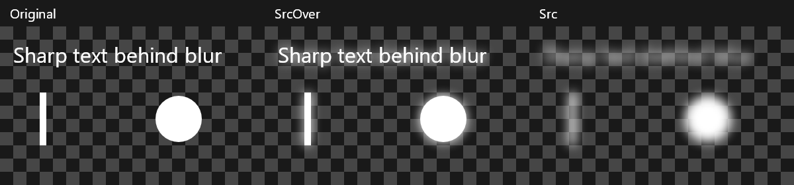

# Backdrop blur experiment

## Purpose

On a transparent background, CSS backdrop blur can leave sharp content visible underneath the blurred result. This experiment tests whether that bleeding comes from drawing the blurred result over the original pixels instead of replacing them.

Skia is Chromium's graphics library. `SrcOver` draws new pixels over existing pixels, allowing the existing content to show through wherever the new pixels are transparent. `Src` replaces the existing pixels, including their alpha. For a transparent blur, that difference determines whether the sharp original remains underneath.

## Running the comparison

Run `dotnet run --project Experiments/BackdropBlur`. Requires the .NET 10 SDK; NuGet supplies SkiaSharp and its native Skia library.

The program draws white text and shapes on a transparent surface, then uses a Skia backdrop layer to blur them. It compares the original with the same filtered layer restored using `SrcOver` (draw over existing pixels) or `Src` (replace existing pixels).

PNG files are written under the executable's `images` folder in `bin`. `comparison.png` shows all three over a checkerboard. The individual images retain transparency. The console also prints the alpha at a pixel inside the original white bar.

`rounded-comparison.png` adds five columns at full, half, and zero layer opacity:

- **Original:** the unchanged backdrop.
- **SrcOver + clear:** capture the blurred backdrop into a rectangular layer, clear outside the rounded shape, then restore with `SrcOver`.
- **Src + clear:** use the same clearing operation, then restore with `Src`, as in the one-byte patch.
- **Src + rounded clip:** clip to the rounded shape before creating the layer and restore with `Src`.
- **Masked replacement:** blend the original and completed blurred result using rounded coverage multiplied by effect opacity, independently of the blurred pixels' alpha.

A white marker sits outside the rounded shape but inside its rectangular bounds. An orange rectangle represents foreground content drawn into the layer. Individual transparent images are saved as `rounded-{column}-{opacity}.png`.

The comparison program isolates these operations. It does not reproduce Chromium's GPU rendering, full CSS opacity handling, masks, forward filters, or nested filters, and does not modify Discord.

## Rounded corners and opacity

Clearing outside the rounded shape and restoring with `Src` erases the white corner marker: its alpha becomes 0 instead of 255. Clipping before creating the layer preserves the marker at 255 while removing the bleeding inside the shape. At full opacity, the original bar's alpha is 121 with either `Src` approach.

Clipping does not fix layer opacity. With half opacity, both `Src` approaches reduce the bar's alpha to 61; at zero opacity they erase the backdrop inside the shape entirely. A disappearing effect should leave the original backdrop visible. Replacement therefore needs to account for effect opacity separately from the transparency of the blurred pixels.

These results support clipping as a fix for the isolated corner defect, but not as a complete Chromium fix. Restricting Chromium's entire layer could also clip foreground content or forward-filter output that is meant to extend beyond the backdrop shape.

## Masked replacement

The fifth column keeps the original backdrop and the completed effect separately. An antialiased rounded mask controls replacement:

```text
result = original * (1 - mask) + completed effect * mask
mask = rounded coverage * effect opacity
```

The calculation uses premultiplied colors, including alpha. `DstOut` removes the masked portion of the original, `DstIn` restricts the completed effect to the mask, and `Plus` adds the two weighted images. Using `SrcOver` for that final step would attenuate the original again based on the effect's alpha.

This preserves the outside marker at every opacity. The bar's alpha is 121 at full opacity, 188 at half opacity, and 255 at zero opacity. The program checks that the marker remains white and that the entire zero-opacity image matches the original byte for byte.

At half opacity, some sharp content intentionally reappears because the effect is fading back to the original. At full opacity, it is replaced by the blurred result. This experiment applies the same mask to the orange foreground rectangle; it does not yet model foreground content extending outside the backdrop shape or Chromium's full compositing pipeline.

## Findings



A perfect replicatation of the bleeding effect you see when using backdrop blur over a transparent background.

In this experiment, `SrcOver` leaves the sharp original visible under the blur. `Src` removes that sharp copy while retaining the blurred result's transparency. At the original bar's center, alpha is 255 with `SrcOver` and 121 with `Src`.

We also tested the change in Discord's actual GPU process:

- Official Electron 42.11.8 symbols identified `viz::SkiaRenderer::PrepareCanvasForRPDQ`, a 428-byte function that selects `SrcOver` when a backdrop filter is present.
- We extracted the function from stock Electron and searched Discord's executable, ignoring address-dependent instruction operands. There was exactly one match, with 373 fixed bytes matching. Discord's PE unwind metadata confirmed the same function boundary and length.
- We verified all 428 bytes in the running GPU process, then changed one byte in the blend-mode argument from `3` (`SrcOver`) to `1` (`Src`). The original memory protection was restored afterward.
- The bleeding disappeared in initial visual testing. Further testing found incorrect rendering around rounded corners and other affected elements, so changing the blend mode alone is not a complete fix.

Chromium first restricts the backdrop layer to rectangular bounds. After capturing the filtered backdrop, `ClearOutsideBackdropBounds` clears pixels outside the actual backdrop shape to transparent. `SrcOver` preserves the destination under those cleared pixels; `Src` replaces it with transparency instead. This explains why removing the bleeding also breaks rounded corners. The layer also carries opacity and other filter effects, which need separate investigation before treating the patch as generally usable.

Chromium explicitly selects this blend mode in [PrepareCanvasForRPDQ](https://github.com/chromium/chromium/blob/148.0.7778.0/components/viz/service/display/skia_renderer.cc). Source-over compositing is also prescribed by the [CSS backdrop-filter specification](https://drafts.csswg.org/filter-effects-2/#backdrop-filter-operation), so this experiment deliberately changes that behavior.

## Native plugin experiment

The original PowerShell byte patch has been replaced by a native C plugin using MinHook in the [plugin collection](https://github.com/bedrock-client/bedrock-plugins/tree/main/plugins/backdrop-blur-fix). Its collection build packages the DLL separately from the launcher. See [the plugin README](https://github.com/bedrock-client/bedrock-plugins/blob/main/plugins/backdrop-blur-fix/README.md) for its behavior and limitations.

The hook clips replacement to the backdrop shape and uses Skia's arithmetic blender to preserve the original according to effect opacity. It skips Chromium's subsequent clearing operation for that layer, since the rounded clip already provides coverage. Cases with additional filters, shader masks or split draw regions retain Chromium's original behavior.

An isolated Electron 42.11.8 app verified that the hook removes the sharp bar, preserves the outside corner marker, interpolates at half opacity, leaves zero opacity unchanged, and restores the original pixels when disabled. This is not yet a general correctness test for Discord's UI. Clipping the entire layer can still restrict foreground content that should extend outside the backdrop shape.

The stock GPU sandbox rejected ordinary DLL loading with access denied. The controller now uses an MIT-licensed manual mapper to supply the DLL from memory, and the rendering fixture passes with the GPU sandbox enabled. No Discord executable files are changed.
